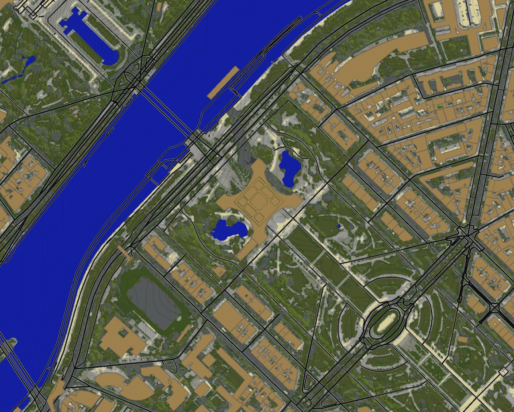

# Osm2Map (Real world in Minecraft)

Osm2Map is only available for `Spigot 1.12.2` for now

### Features
- **Custom World Generator** based on OpenStreetMap data
   - Buildings
   - Gardens
   - Water
   - Trees
   - Ground color using satellite images
- **Teleporting to Ways or POIs** by name
- **Multi World Support**
   - One different config for each World
- **Builtin Guard System** (optional)
   - Claim/Unclaim zones (buildings/gardens)
   - Build with friends in the same zone
   - Support of FAWE's (Fast WorldEdit) Mask system 
- **Customizable**
   - Change all blocks used by the Generator (ground, ways, ...)

Example Eiffel Tower :

### Doc pages
- [Installation](.github/doc/INSTALL.md)
- [Configuration](.github/doc/CONFIG.md)
- [Commands and Permissions](.github/doc/COMMANDS.md)
- [Guard Mode](.github/doc/GUARD.md)
- [Satellite Images (ground coloring)](.github/doc/TILES.md)
- [OpenStreetMap](.github/doc/OSM.md)